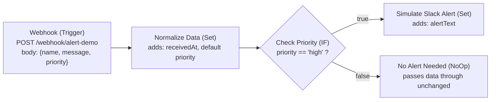
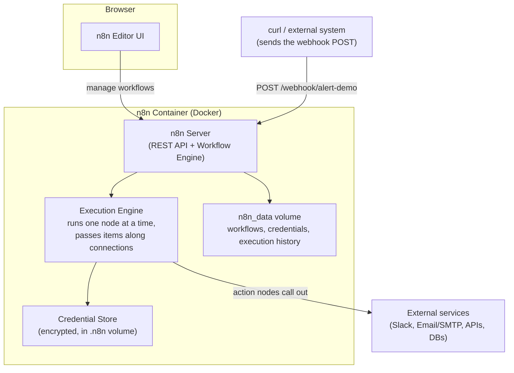

# Architecture Diagrams

## 1. Demo workflow data flow

Shows what the JSON payload looks like as it passes through each node.

**What changes at each step:**

| Stage | Example item data |
|---|---|
| Into Webhook | `{ "body": { "name": "Dave", "message": "Server CPU at 95%", "priority": "high" } }` |
| Out of Normalize Data | `{ "name": "Dave", "message": "Server CPU at 95%", "priority": "high", "receivedAt": "2026-07-06T14:20:00.000Z" }` |
| Out of Simulate Slack Alert (true branch) | same, plus `{ "alertText": "🚨 HIGH PRIORITY from Dave: Server CPU at 95%" }` |
| Out of No Alert Needed (false branch) | unchanged from Normalize Data |

## 2. n8n component overview

Where this demo's pieces sit inside n8n's own architecture.

**Key idea:** the Editor UI is just a client of the n8n server — the server is what actually stores workflows, receives webhooks, and runs executions. This is why the workflow keeps running even if you close your browser tab.
